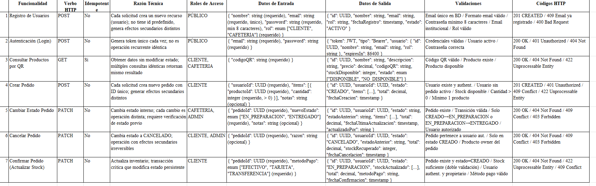
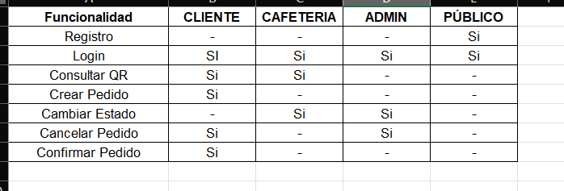

# ECIXPRESS - Gestión de Pedidos en Cafeterías

## Información del Proyecto
- **Autor:** Juan David Valero y Carlos Andres Uribe Vargas
- **Grupo:** [1]
- **Versión de Java:** 21
- **Framework:** Spring Boot 3.1.5
- **Base de Datos:** MySQL 8.0
## Caso de Estudio
La empresa DOSW ha sido seleccionada para desarrollar el MVP de la nueva
aplicación que saldrá al mercado estudiantil ECIXPRESS, una aplicación web
orientada a la gestión de pedidos en cafeterías institucionales mediante el uso de
códigos QR, permitiendo así que los usuarios ya no tengan que hacer filas.
El objetivo del MVP es permitir a los usuarios realizar pedidos de manera ágil,
escaneando productos y gestionando su compra desde el registro hasta la
entrega del pedido.
📌 Entidades principales
Usuario
● Identificador único
● Nombre completo
● Correo electrónico (institucional)
● Contraseña
● Rol (cliente / señora de la cafetería)
☕ Producto
● Nombre
● Descripción
● Precio
● Código QR - Identificador único
● Stock disponible
● Estado (disponible / no disponible)
🛒 Pedido
● Identificador único
● Usuario (cliente)
● Lista de productos
● Cantidades
● Estado
○ CREADO
○ EN_PREPARACION
○ ENTREGADO
○ CANCELADO
● Total del pedido
● Fecha de creación
⚙️ Funcionalidades
● Los usuarios pueden registrarse usando su correo institucional.
● Pueden autenticarse en la plataforma.
● Los productos pueden ser consultados mediante escaneo de código QR.
● Un usuario puede crear un pedido agregando productos escaneados.
● El sistema valida disponibilidad de stock antes de agregar productos.
● Un usuario solo puede tener un pedido activo.
● Los pedidos inician en estado CREADO.
● El administrador puede cambiar el estado del pedido a:
○ EN_PREPARACION
○ ENTREGADO
● El cliente puede cancelar el pedido solo en estado CREADO.
● El sistema debe actualizar el stock al confirmar el pedido.
● El sistema tiene que ser responsive y adicionalmente los colores que
maneja en su gama visual son naranjas, amarillos y blancos.
ACTIVIDADES A DESARROLLAR - PARTE TEÓRICA
En base al anterior enunciado, se espera que ustedes como equipo de desarrollo
puedan realizar las siguientes actividades para cumplir con el producto.
Para la parte teórica generen una rama por punto ,una vez esté
completa mezclen sobre develop y borre la rama - si no está sobre
develop no se calificara el entregable teórico.
1. Para cada una de las siete funcionalidades identificadas en el caso de
estudio menciona: (se le recomienda manejar los siguientes puntos
como una tabla de excel)
a. Que tipo de verbo HTTP Maneja
b. Establezca si es una funcionalidad idempotente o no
c. Cuál es la razón técnica de su decisión.
d. Cuáles Roles de los identificados tienen acceso a esa funcionalidad
e. Mencione sus datos de entrada y de salida (Establezca de qué tipo
es cada propiedad y si es obligatorio o no)
f. De un ejemplo de cómo se vería la entrada y la salida.
g. Establezca qué validaciones de input y el negocio debe tener en
cuenta.
h. Establezca los códigos HTTP y mensaje para Happy Path y Flujo de
Error
2. Explique la diferencia entre Validaciones de input y Validaciones de
negocio
3. Explique la diferencia entre autenticación, autorización e integridad.
4. Genere el diagrama de componentes general del sistema ECIXPRESS
5. ¿Qué problemas pueden surgir si no se separan correctamente las capas
dentro de un proyecto de software?
6. Genere el diagrama de componentes específicos del sistema ECIXPRESS
7. ¿Cuáles son las diferencias entre un validador, una utilidad y un servicio?
8. Genere el diagrama de clases de los modelos y responda: ¿Qué patrón de
software usaría para manejar los estados del pedido y por qué?
9. Genere el diagrama entidad-relación para el marco relacional de
persistencia.
10.Proponga 2 índices que mejoren el rendimiento de las consultas de
ECIXPRESS y establezca con un criterio técnico el porque dan valor a la
solución.
11.Como parte de la solución, es fundamental definir un conjunto robusto de
pruebas que garantice la calidad y correcto funcionamiento de las
funcionalidades expuestas en el sistema. Dado el enfoque de
transparencia con el cliente, se requiere evidenciar cómo se desarrollaría
la funcionalidad de “Solicitar pedido” siguiendo el enfoque de TDD (Test
Driven Development). En este contexto, se espera que usted:
● Describa cómo se aplican las fases de TDD (Red, Green,
Refactor) en la implementación de esta funcionalidad.
● Defina los casos de prueba iniciales antes de la implementación,
contemplando tanto escenarios exitosos como de error.
● Identifique las validaciones clave que deben ser cubiertas por las
pruebas.
12.Explique cómo las pruebas garantizan el cumplimiento de las reglas de
negocio y la integridad del sistema.
13.Nuestro cliente quiere automatizar el proceso del ciclo de vida de la
aplicación, sin embargo necesita entender cómo funciona, describa las
etapas principales de un pipeline y en qué consiste cada una.
14.¿Qué sucede si una prueba falla en el pipeline? ¿Debe permitirse el
despliegue? Justifique
15. Explique el concepto de logging en el manejo de errores:
a. ¿Qué información debería registrarse?
b. ¿Qué NO debería registrarse (por seguridad)?
16. Como parte del MVP, el cliente requiere una validación visual del producto.
Diseñe en Figma las pantallas necesarias para el flujo de:
● Registro de usuario
● Inicio de sesión
● Selección de productos y su detalle
● Creación del pedido


## 3. Diferencia entre Autenticación, Autorización e Integridad

Estos tres conceptos son fundamentales en seguridad, pero cumplen funciones diferentes:
---

## ACTIVIDADES A DESARROLLAR - PARTE PRÁCTICA:
Por cada funcionalidad que van a realizar generen una rama feature y
una vez esté completa mezcle sobre develop y borre su rama - si no está
sobre develop no se calificara el entregable práctico.
1. Implemente a nivel de código las funcionalidades relacionadas con el flujo
de Registro de usuarios y Creación del pedido, Recuerde que tiene que
estar alineado con:
a. Las definiciones que menciono de Request y Response (Códigos de
error)
b. Validaciones de input y negocio.
c. Componentes diagramados en los diagramas de componentes
específicos, de clases y entidad-relación.
2. Implemente la documentación Swagger de su API
3. Genere las pruebas unitarias correspondientes para las funcionalidades
presentadas - Agregue a su README el análisis de cobertura con jacoco y
el análisis estático.
4. Realice pruebas funcionales de su API mostrando que está utilizando
swagger o postman junto a los logs que generó en la aplicación por cada
operación probada y sus escenarios.
5. Implementa Seguridad para el tema de autenticación y manejo de
permisos por roles para las operaciones que desarrollaste.
BONO:
A. Genere con Github Actions un pipeline que permite automatizar el ciclo de
su aplicación: build, test and deploy, este pipeline se debe ejecutar cada
vez que realice una mezcla de feature a develop.
B. Genere el despliegue de su aplicación en Azure DevOps y agregue en el
README el link del despliegue.
- **Descripción:** MVP de aplicación web para gestión de pedidos en cafeterías institucionales mediante códigos QR

---

## Especificación de Funcionalidades

### Funcionalidades Identificadas - Análisis de Requisitos REST API



---

## Ejemplos JSON 

### 1. Registro de Usuario

**Entrada (POST /auth/registro):**
```json
{
  "nombre": "Juan García López",
  "email": "juan.garcia@institucion.edu.co",
  "password": "Segura2024!",
  "rol": "CLIENTE"
}
```

**Salida 201 Created:**
```json
{
  "id": "550e8400-e29b-41d4-a716-446655440000",
  "nombre": "Juan García López",
  "email": "juan.garcia@institucion.edu.co",
  "rol": "CLIENTE",
  "fechaRegistro": "2026-04-10T14:30:00Z",
  "estado": "ACTIVO"
}
```

**Error 409 Conflict:**
```json
{
  "error": "Conflict",
  "mensaje": "El email juan.garcia@institucion.edu.co ya está registrado",
  "timestamp": "2026-04-10T14:30:00Z"
}
```

---

### 2. Autenticación (Login)

**Entrada (POST /auth/login):**
```json
{
  "email": "juan.garcia@institucion.edu.co",
  "password": "Segura2024!"
}
```

**Salida 200 OK:**
```json
{
  "token": "eyJhbGciOiJIUzI1NiIsInR5cCI6IkpXVCJ9.eyJzdWIiOiI1NTBlODQwMC1lMjliLTQxZDQtYTcxNi00NDY2NTU0NDAwMDAiLCJpYXQiOjE3MTI3NTAwMDAsImV4cCI6MTcxMjgzNjQwMH0.signature",
  "tipo": "Bearer",
  "usuario": {
    "id": "550e8400-e29b-41d4-a716-446655440000",
    "nombre": "Juan García López",
    "email": "juan.garcia@institucion.edu.co",
    "rol": "CLIENTE"
  },
  "expiresIn": 86400
}
```

---

### 3. Consultar Producto por QR

**Entrada (GET /productos/qr?codigoQR=PROD123456789):**
```json
{
  "codigoQR": "PROD123456789"
}
```

**Salida 200 OK:**
```json
{
  "id": "660e8400-e29b-41d4-a716-446655440001",
  "nombre": "Café Cappuccino",
  "descripcion": "Bebida caliente preparada con espresso y leche vaporizada",
  "precio": 4500.00,
  "codigoQR": "PROD123456789",
  "stockDisponible": 45,
  "estado": "DISPONIBLE"
}
```

---

### 4. Crear Pedido

**Entrada (POST /pedidos):**
```json
{
  "usuarioId": "550e8400-e29b-41d4-a716-446655440000",
  "items": [
    {
      "productoId": "660e8400-e29b-41d4-a716-446655440001",
      "cantidad": 2
    },
    {
      "productoId": "770e8400-e29b-41d4-a716-446655440002",
      "cantidad": 1
    }
  ],
  "notas": "Café sin azúcar"
}
```

**Salida 201 Created:**
```json
{
  "id": "880e8400-e29b-41d4-a716-446655440000",
  "usuarioId": "550e8400-e29b-41d4-a716-446655440000",
  "estado": "CREADO",
  "items": [
    {
      "productoId": "660e8400-e29b-41d4-a716-446655440001",
      "nombre": "Café Cappuccino",
      "cantidad": 2,
      "precioUnitario": 4500.00,
      "subtotal": 9000.00
    },
    {
      "productoId": "770e8400-e29b-41d4-a716-446655440002",
      "nombre": "Croissant",
      "cantidad": 1,
      "precioUnitario": 3500.00,
      "subtotal": 3500.00
    }
  ],
  "total": 12500.00,
  "notas": "Café sin azúcar",
  "fechaCreacion": "2026-04-10T15:00:00Z"
}
```

---

### 5. Cambiar Estado Pedido

**Entrada (PATCH /pedidos/880e8400-e29b-41d4-a716-446655440000/estado):**
```json
{
  "pedidoId": "880e8400-e29b-41d4-a716-446655440000",
  "nuevoEstado": "EN_PREPARACION",
  "notas": "Preparando el pedido"
}
```

**Salida 200 OK:**
```json
{
  "id": "880e8400-e29b-41d4-a716-446655440000",
  "usuarioId": "550e8400-e29b-41d4-a716-446655440000",
  "estado": "EN_PREPARACION",
  "estadoAnterior": "CREADO",
  "items": [...],
  "total": 12500.00,
  "notas": "Preparando el pedido",
  "fechaUltimaActualizacion": "2026-04-10T15:05:00Z",
  "actualizadoPor": "cafeteria@institucion.edu.co"
}
```

---

### 6. Cancelar Pedido

**Entrada (PATCH /pedidos/880e8400-e29b-41d4-a716-446655440000/cancelar):**
```json
{
  "pedidoId": "880e8400-e29b-41d4-a716-446655440000",
  "razon": "El cliente cambió de opinión"
}
```

**Salida 200 OK:**
```json
{
  "id": "880e8400-e29b-41d4-a716-446655440000",
  "usuarioId": "550e8400-e29b-41d4-a716-446655440000",
  "estado": "CANCELADO",
  "estadoAnterior": "CREADO",
  "total": 12500.00,
  "razon": "El cliente cambió de opinión",
  "stockRecuperado": 3,
  "fechaCancelacion": "2026-04-10T16:00:00Z"
}
```

---

### 7. Confirmar Pedido (Actualizar Stock)

**Entrada (PATCH /pedidos/880e8400-e29b-41d4-a716-446655440000/confirmar):**
```json
{
  "pedidoId": "880e8400-e29b-41d4-a716-446655440000",
  "metodoPago": "TARJETA"
}
```

**Salida 200 OK:**
```json
{
  "id": "880e8400-e29b-41d4-a716-446655440000",
  "usuarioId": "550e8400-e29b-41d4-a716-446655440000",
  "estado": "EN_PREPARACION",
  "metodoPago": "TARJETA",
  "stockActualizado": [
    {
      "productoId": "660e8400-e29b-41d4-a716-446655440001",
      "nombre": "Café Cappuccino",
      "cantidadAnterior": 45,
      "cantidadNueva": 43
    },
    {
      "productoId": "770e8400-e29b-41d4-a716-446655440002",
      "nombre": "Croissant",
      "cantidadAnterior": 30,
      "cantidadNueva": 29
    }
  ],
  "total": 12500.00,
  "fechaConfirmacion": "2026-04-10T15:10:00Z"
}
```

---

## Matriz de Acceso por Rol

## Matriz de Acceso por Rol



### Ejecutar el Proyecto
```bash
mvn clean install
mvn spring-boot:run
```
---

## Solucion

### 2. Diferencia entre Validaciones de Input y Validaciones de Negocio

#### **Validaciones de Input**

Las validaciones de input son aquellas que verifican el formato y estructura correcta de los datos que envía el cliente. Se enfoca en la integridad sintáctica de los datos, sin considerar las reglas del dominio del negocio.

**Características:**
- Se ejecutan en el primer punto de entrada de la solicitud
- Validan propiedades técnicas del dato: tipo, longitud, patrón, formato
- No requieren acceso a la lógica de negocio o base de datos
- Son independientes del contexto de negocio
- Generan error `400 Bad Request`

**Ejemplos en ECIXPRESS:**
```
- Email con formato válido (debe contener @)
- Contraseña con mínimo 8 caracteres
- Cantidad debe ser número positivo > 0
- Código QR debe contener solo alfanuméricos
- Precio debe ser decimal válido
- UUID debe tener formato correcto (36 caracteres con guiones)
```
#### **Validaciones de Negocio**

### **Autenticación: ¿Quién eres?**

La autenticación verifica **quién eres tú**. Es como presentar tu documento de identidad. El sistema te pide credenciales (usuario y contraseña) para confirmar que eres quien dices ser.

**En ECIXPRESS:**
- Usuario ingresa: email y contraseña
- Sistema verifica que la contraseña coincida
- Si es correcto, te da un token JWT (tu "pase" de entrada)
- No importa qué hagas, primero debes autenticarte


### **Autorización: ¿Qué puedes hacer?**

La autorización verifica **qué tienes permiso de hacer**. Es como tener un carnet que te permite entrar a ciertos lugares. Una vez autenticado, el sistema verifica si tu rol te permite realizar esa acción.

**En ECIXPRESS:**
- Cliente autenticado → Puede crear pedidos
- Cliente autenticado → NO puede cambiar estado de pedidos (solo cafetería)
- Cafetería autenticada → Puede cambiar estado
- Cafetería autenticada → NO puede crear pedidos


### **Integridad: ¿Fue modificado?**

La integridad verifica que **los datos no hayan sido alterados**. Es asegurar que lo que envías sea exactamente lo mismo que recibe el servidor, sin cambios en el camino.

**Métodos comunes:**
- **Hash/Checksum**: Calcular un código único del mensaje. Si alguien lo modifica, el hash cambia
- **Firma Digital**: Firmar el mensaje con clave privada para probbar que vraiste de quien dices
- **HTTPS**: Cifra todo el tráfico para evitar que se modifique en tránsito

**En ECIXPRESS:**
- Todo se comunica por HTTPS (cifrado)
- El JWT tiene firma digital (no se puede modificar sin que se note)
- El servidor verifica el JWT: si fue modificado, es rechazado

```
Cliente                           Servidor
  │                                 │
  ├─ Email + Contraseña (HTTPS)─→  │ Autenticación: ¿quién eres?
  │                                 │
  ├─ JWT Token ←─────────────────  │
  │                                 │
  ├─ Crear Pedido + JWT (HTTPS)─→  │ Integridad: ¿fue modificado el JWT?
  │                                 │ Autorización: ¿tienes permiso?
  │                                 │
  └─ 201 Created ←───────────────  │
```

### **Resumen Práctico**
**Ejemplos prácticos:**
- **Input**: Validar que un email tiene formato válido (contiene @) vs **Negocio**: Validar que el email no está registrado
- **Input**: Validar que la cantidad es un número > 0 vs **Negocio**: Validar que hay cantidad disponible en stock


#### **Impacto en la Calidad**

| Concepto | Pregunta | Ejemplo | Error |
|----------|----------|---------|-------|
| **Autenticación** | ¿Quién eres? | Usuario envía credenciales | 401 Unauthorized |
| **Autorización** | ¿Qué permitido haces? | Verificar rol del usuario | 403 Forbidden |
| **Integridad** | ¿Fue modificado? | Verificar firma del JWT | 401 Unauthorized (token inválido) |

**En orden de ejecución siempre es:**
1. **Autenticación** → ¿Eres quién dices ser?
2. **Integridad** → ¿Los datos no fueron modificados?
3. **Autorización** → ¿Tienes permiso para esto?

